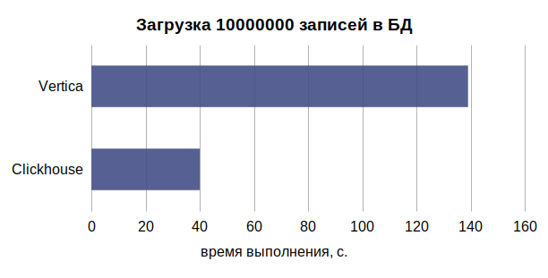
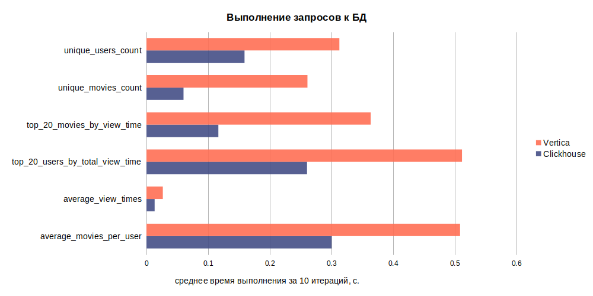
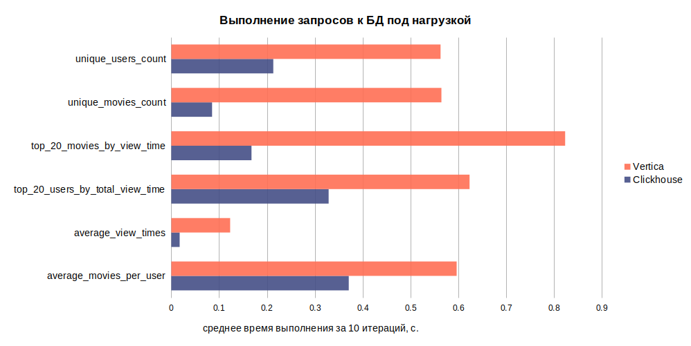

## Тестирование производительности OLAP-хранилищ

В ходе тестирования были рассмотрены Clickhouse и Vertica.

### Запуск и первоначальная настройка

- `make run` - запуск docker-compose с тестируемыми хранилищами
- `make stop` - остановка docker-compose с тестируемыми хранилищами
- `make seed_db` - заполнение хранилищ тестовыми данными
- `make run_benchmarks` - запуск тестов

### Загрузка тестовых данных

Структура тестовой таблицы **views**

| имя столбца      | тип данных |
| ----------- | ----------- |
| id      | UUID       |
| user_id   | UUID        |
| movie_id   | UUID        |
| viewed_frame   | Int        |

**Результаты:**

Сlickhouse | Vertica | разница в %
| --- | --- | --- |
40 | 139 | 71.22

### Выполнение запросов к БД
**Используемые запросы:**

- average_movies_per_user

        SELECT avg(movies_watched) 
        FROM ( 
            SELECT count(movie_id) as movies_watched 
            FROM views 
            GROUP BY user_id 
           ) AS movies_count;

- average_view_times

        SELECT avg(viewed_frame) FROM views;

- top_20_users_by_total_view_time

        SELECT user_id, sum(viewed_frame) AS view_time  
        FROM views 
        GROUP BY user_id 
        ORDER BY view_time DESC 
        LIMIT 20;

- top_20_movies_by_view_time

        SELECT movie_id, max(viewed_frame) AS view_time 
        FROM views 
        GROUP BY movie_id 
        ORDER BY view_time DESC 
        LIMIT 20; 

- unique_movies_count

        SELECT count(DISTINCT movie_id) FROM views;

- unique_users_count
    
        SELECT count(DISTINCT user_id) FROM views;

**Результаты:**

запрос | Сlickhouse | Vertica | разница в %
| --- | --- | --- | --- |
average_movies_per_user | 0.3002 | 0.5085 | 40.96
average_view_times | 0.0133 | 0.0266 | 50.00
top_20_users_by_total_view_time | 0.2604 | 0.5116 | 49.10
top_20_movies_by_view_time | 0.1166 | 0.3636 | 67.93
unique_movies_count | 0.0601 | 0.2611 | 76.98
unique_users_count | 0.159 | 0.3128 | 49.17
| |  | **avg:** | 55.69

запрос | Сlickhouse | Vertica | разница в %
| --- | --- | --- | --- |
average_movies_per_user | 0.3711 | 0.5967 | 37.81
average_view_times | 0.0175 | 0.1231 | 85.78
top_20_users_by_total_view_time | 0.329 | 0.6237 | 47.25
top_20_movies_by_view_time | 0.1677 | 0.8235 | 79.64
unique_movies_count | 0.0853 | 0.5648 | 84.90
unique_users_count | 0.2133 | 0.5631 | 62.12
| |  | **avg:** | 66.25

### Выводы

В качестве OLAP-хранилища был выбран Clickhouse, т.к. данное решение 
показало более высокую производительность при загрузке данных (на 71%) и выполнении аналитических запросов (до 66%)
